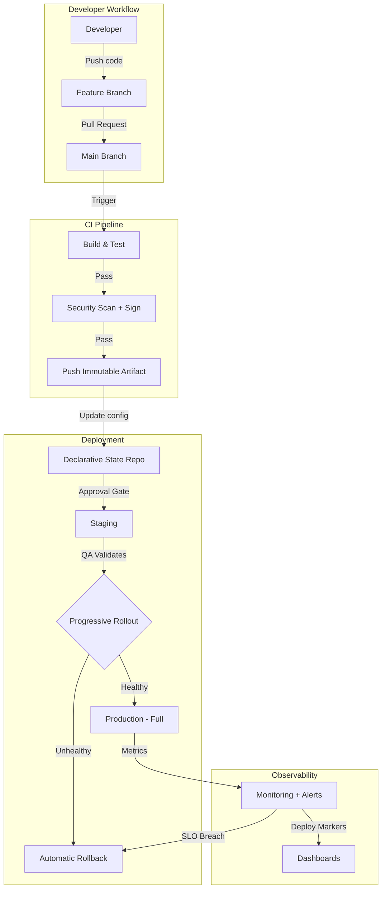
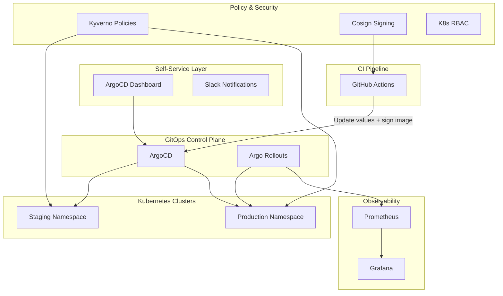
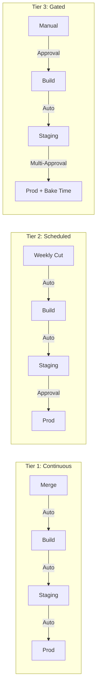

# Engineering Platform Proposal

**Author:** Bernadin Pegdwende  
**Date:** July 2026  
**Repository:** [github.com/pegdwende1/platform-assessment-submission](https://github.com/pegdwende1/platform-assessment-submission)

---

## About This Proposal

This document presents my approach to building a release engineering platform for a growing multi-product organization. I've structured it to answer every section of the assessment in a single cohesive narrative.

**How I approached this:**
- I started by identifying the underlying problem (inconsistent, opaque, high-risk deployments) before reaching for specific tools.
- I frame the strategy as tool-agnostic principles first, then demonstrate a concrete implementation using Kubernetes and GitOps as my chosen example.
- Where trade-offs exist, I name them explicitly rather than pretending a single approach solves everything.
- The accompanying repository contains a working CI/CD demonstration that implements these ideas in code.

**Key assumption:** The assessment doesn't specify a runtime platform, so I've chosen Kubernetes as the implementation example because it offers the richest ecosystem for progressive delivery, policy enforcement, and GitOps. However, the principles (declarative deployments, progressive rollouts, auditable releases, self-service) apply equally to ECS, serverless, or VM-based environments. Where my recommendations would differ for non-K8s environments, I note that.

**Accompanying demonstration:** The repository implements the Phase 1 foundation described in this proposal — GitOps-based promotion through environments, image signing with Cosign, progressive delivery via Argo Rollouts, dual container scanning, SBOM generation, and policy enforcement with Kyverno. The CI/CD pipeline and Helm chart are working code, not scaffolding.

---

## 1. Current State Assessment

### Challenges Identified

| Challenge | Impact |
|-----------|--------|
| **Ad-hoc deployment processes** | Each team deploys differently; failures are unpredictable and hard to debug |
| **No standardized release cadence** | Stakeholders can't predict when features ship; teams can't coordinate cross-product releases |
| **QA engineers lack safe release tooling** | DevOps becomes a bottleneck for every deployment, creating a ticket queue |
| **Limited rollback confidence** | Recovery depends on tribal knowledge rather than reliable mechanisms |
| **Poor observability into releases** | "What's deployed where?" requires checking multiple systems or asking someone |
| **Configuration drift** | Manual interventions accumulate; staging and production diverge silently |
| **Scaling pressure** | Processes that work for 3 teams break at 10 teams |

### Risks That Concern Me Most

1. **Incident during manual deployment** — Without standardized rollback, a bad deploy becomes a firefight rather than a routine recovery.
2. **Key-person dependency** — If deployments require specific individuals, any absence creates organizational risk.
3. **Shadow processes** — When the official path is slow, teams build undocumented workarounds that are invisible until they break.
4. **Change fatigue** — If the platform initiative is perceived as "yet another process change," teams will resist adoption.
5. **Premature standardization** — Forcing a single approach on teams with legitimately different needs creates friction that undermines the effort.

### Information I Would Gather Before Beginning

| Question | Why It Matters |
|----------|----------------|
| How many services exist, and how are they deployed today? | Determines scope and identifies which teams are closest to ready |
| What's the current deployment-related incident rate? | Quantifies the problem; helps prioritize where to start |
| What technology stacks are in use? | Influences whether one platform fits all or you need multiple golden paths |
| What CI/CD tooling exists today? | Determines migration effort vs. building on what's there |
| Where do services run? (K8s, ECS, VMs, serverless?) | Fundamentally shapes the platform architecture |
| What's the team topology? | Determines who builds vs. consumes the platform |
| What's the organization's risk tolerance by product? | Informs cadence tiers and gate strictness |
| Are there compliance requirements? (SOC2, HIPAA, PCI?) | Drives audit trail, signing, and approval requirements |
| What's the budget for tooling? | Constrains technology choices |

---

## 2. Platform Strategy

### Vision

Build an **internal developer platform** that makes safe, observable, repeatable deployments the path of least resistance. The platform provides capabilities as self-service building blocks — teams consume what they need without becoming dependent on a central team for day-to-day operations.

### Guiding Principles (Tool-Agnostic)

These principles hold regardless of whether the implementation is Kubernetes, ECS, serverless, or VMs:

1. **Make the safe path the easy path** — Don't just prevent bad things; make the right thing require less effort than the wrong thing.
2. **Adopt incrementally** — Teams opt in when the platform demonstrably improves their workflow. No big-bang migrations.
3. **Convention over configuration** — Sensible defaults that work for 80% of cases. Overriding is possible but explicit.
4. **Decouple CI from CD** — Building an artifact and deploying it are separate concerns with different owners and failure modes.
5. **Declarative desired state** — The deployment target is described in version control. Every deployment is a commit, every rollback is a revert.
6. **Measure the platform itself** — DORA metrics, adoption rates, developer satisfaction. If the platform isn't making teams faster, it's not working.

### Major Capabilities

| Capability | What It Provides |
|------------|------------------|
| **Standardized CI pipelines** | Reusable templates for build, test, scan, package — teams consume them, don't build their own |
| **Declarative deployment** | Auditable deployments through version-controlled configuration with automatic drift detection |
| **Progressive delivery** | Canary/blue-green rollouts with automated health validation — deploy fast, promote safely |
| **Self-service release management** | UI/ChatOps for QA to trigger, monitor, and roll back deployments without deep infrastructure knowledge |
| **Observability integration** | Deploy markers on dashboards, SLO-based deployment gates, centralized deployment logs |
| **Policy enforcement** | Automated checks ensuring security and operational standards are met before code reaches production |
| **Supply chain security** | Image signing, SBOM generation, vulnerability tracking |
| **Service catalog** | Central registry of what exists, who owns it, what's deployed, and how to interact with it |

### Balancing Standardization with Flexibility

**Standardize the mechanism, not the policy.**

| Layer | Standardized (non-negotiable) | Flexible (team's choice) |
|-------|-------------------------------|--------------------------|
| **CI** | Security scanning runs, tests must pass, artifacts are signed | Test framework, build tools, language |
| **CD** | Declarative, auditable, version-controlled | Deployment cadence, rollout strategy parameters |
| **Packaging** | Immutable container images | Base image, internal dependencies |
| **Observability** | Standard metrics format, deploy markers present | Dashboard layout, alerting thresholds |
| **Security** | Non-root containers, resource limits, health probes | Specific limit values, probe paths |

---

## 3. Technology Recommendations

### Chosen Implementation: Kubernetes + GitOps

For this proposal and the accompanying demonstration, I chose Kubernetes as the runtime platform. Here's why, and when I'd choose differently:

| Recommendation | Why | Alternatives Considered | When I'd Choose Differently |
|----------------|-----|------------------------|----------------------------|
| **ArgoCD (GitOps)** | Industry standard, excellent UI for QA, RBAC for multi-team, large community | Flux (lighter but weaker UI), Spinnaker (multi-cloud but complex) | Non-K8s: AWS CodeDeploy for ECS, or Spinnaker for multi-cloud |
| **Argo Rollouts** | Progressive delivery native to K8s, automated canary analysis | Flagger, Istio native canary | Non-K8s: AWS AppMesh canary, or feature flags for serverless |
| **Helm** | Templated manifests, library chart pattern, values overrides per env | Kustomize (simpler but harder to share), cdk8s (too code-heavy) | Simple apps: Kustomize. Very complex: Pulumi/cdk8s |
| **GitHub Actions** | Lives next to code, reusable workflows, marketplace | GitLab CI, Tekton, Jenkins | Already on GitLab: use GitLab CI. Need K8s-native CI: Tekton |
| **Cosign / Sigstore** | Keyless signing, no secret management, verifiable provenance | Notary v2 (complex), GPG (painful key management) | Enterprise with HSMs: Notary v2 |
| **Kyverno** | YAML-based policies, easy for developers to write | OPA/Gatekeeper (more powerful but steeper curve) | Complex cross-resource policies: OPA Gatekeeper |
| **Prometheus + Grafana** | Open source, K8s-native, integrates with Argo Rollouts analysis | Datadog (better UX, $$$), New Relic | Already paying for Datadog: integrate, don't replace |

---

## 4. Establishing a Predictable Release Cadence

### Approach

Rather than mandating a single cadence, establish **cadence tiers** based on product risk profile:

| Tier | Cadence | How It Works | Example |
|------|---------|--------------|---------|
| **Continuous** | On merge to main | CI builds image → CD auto-deploys | Low-risk internal tools, feature-flagged services |
| **Scheduled** | Weekly or biweekly | Release train cuts at fixed intervals → promotion requires approval | Core product services |
| **Gated** | On-demand with approval | Manual trigger → multi-approver gate → progressive rollout with bake time | Payment systems, auth, data-sensitive services |

### Implementation (K8s Example)

- **Tier 1:** ArgoCD auto-sync enabled + Image Updater auto-detects new images
- **Tier 2:** Weekly CI cron job creates a PR bumping image tags; QA approves via GitHub Environment gate
- **Tier 3:** Manual sync in ArgoCD UI + Argo Rollouts pause steps between canary weight increases

### Decoupling Deploy from Release

Use **feature flags** to deploy code continuously but activate features on schedule. This gives predictability of scheduled releases with the safety of small deploys.

---

## 5. Standardizing Deployment Practices

### Key Standards (Platform-Agnostic)

- **Immutable artifacts** — build once, promote through environments. Never rebuild between staging and production.
- **Declarative configuration in version control** — deployment state is described in Git, not in someone's head.
- **Progressive rollouts** — canary or blue-green as the default. Validate health before full traffic shift.
- **Environment parity** — staging mirrors production. Differences are explicitly documented.

### Implementation (K8s Example)

- **Shared Helm library chart** — base chart provides Rollout, Service, HPA, PDB, NetworkPolicy templates. Teams only supply a `values.yaml`.
- **GitOps repo structure** — separate values files per environment, ArgoCD syncs the declared state.
- **Admission policies (Kyverno)** — enforce standards at deploy time: signed images, resource limits, probes, no `:latest` tags.

---

## 6. Enabling QA Engineers to Manage Routine Releases

### Approach

Build a **self-service layer** that abstracts infrastructure complexity behind safe, auditable actions with guardrails.

### Capabilities

- **One-click promotion** — promote a validated artifact from staging to production
- **Real-time deployment visibility** — see what's deployed, what's in progress, what's healthy
- **Automated guardrails** — pre-checks (test results, security scans) block unsafe releases without requiring DevOps intervention
- **Scoped permissions** — QA can trigger deployments for their product area; blast radius is limited by design

### Implementation (K8s Example)

- **ArgoCD UI + RBAC** — QA gets sync/rollback permissions scoped to their product's namespaces
- **Argo Rollouts Dashboard** — visual canary progress, promote/abort buttons
- **Graduated trust** — start with staging only, expand to production Tier 1 services, then Tier 2 as confidence grows

### Why This Matters

QA engineers are closest to product quality. Giving them release ownership shortens feedback loops and frees DevOps to focus on platform improvements rather than being a deployment bottleneck.

---

## 7. Improving Visibility, Rollback, and Observability

### Release Visibility

- **Deployment ledger** — every deployment recorded with: who triggered it, what changed, which environments affected, outcome
- **Deploy markers on dashboards** — annotate monitoring dashboards with deployment events for instant correlation
- **Real-time notification feed** — Slack channel showing deployment events across all products
- **Auto-generated changelogs** — from conventional commits between release tags

### Rollback Capabilities

| Method | Speed | How |
|--------|-------|-----|
| **Abort canary** | ~5 seconds | Traffic returns to stable version immediately |
| **Platform UI rollback** | ~30 seconds | Redeploys previous known-good version |
| **Git revert** | ~2 minutes | Revert the promotion commit → CD auto-syncs previous state |

**Design principles for rollback:**
- Database migrations must be forward-compatible (expand-and-contract pattern)
- Previous artifacts are always retained and deployable
- Rollback drills quarterly — confidence comes from practice

### Observability

- **SLO-based deployment gates** — if error budget is exhausted, deployments pause until recovery
- **Automated canary analysis** — metrics queries (error rate, latency) evaluated at each rollout step
- **Centralized deployment logs** — searchable history of every deployment step, not just app logs

---

## 8. Maintainability at Scale

### Principles

- **Platform team, not ticket queue** — build self-service tooling rather than manually handling requests
- **Golden paths** — new services start with a working deployment pipeline on day one
- **Ownership model** — service teams own their release health; platform team owns shared infrastructure
- **Progressive complexity** — simple services use simple pipelines; add gates and analysis only when risk demands it

### Scaling Mechanisms

- **Auto-discovery** — new services are automatically detected and get deployment infrastructure (ArgoCD ApplicationSets)
- **Service catalog** — Backstage gives every team visibility into deployment status, ownership, and docs
- **Policy as code** — organizational policies are automated checks, not tribal knowledge
- **DORA metrics** — deployment frequency, lead time, change failure rate, MTTR — identify bottlenecks as the org grows

---

## 9. Prioritization & Trade-offs

These goals create natural tensions:

| Tension | Resolution |
|---------|------------|
| Standardization vs. team autonomy | Standardize the mechanism (how), not the policy (when/how often). Provide templates with escape hatches. |
| Speed vs. safety | Progressive rollouts give both — deploy immediately, promote only when healthy. |
| QA empowerment vs. risk | Scope permissions tightly. Automated analysis provides a safety net that catches what humans miss. |
| Predictability vs. flexibility | Cadence tiers let teams choose their rhythm while staying predictable to stakeholders. |
| Comprehensive tooling vs. shipping quickly | Phase the work. Each phase delivers standalone value. |

---

## 10. Implementation Roadmap

### 3-Month Timeline: Foundation

**Focus:** Reduce deployment risk immediately for pilot services.

| Deliverable | What It Achieves |
|-------------|------------------|
| GitOps repo + declarative CD | Audit trail, drift detection, instant rollback via revert |
| Shared CI templates (build, test, scan, push) | Consistent quality gates across services |
| Progressive delivery for production | Canary catches bad deploys before they affect all users |
| QA can trigger deployments via UI | Removes DevOps as deployment bottleneck |
| Image signing | Supply chain security from day one |

**Deferred:** Service catalog, SBOM/Dependency-Track, multi-cluster, self-service onboarding automation.

**Compromises I accept:** Only 2-3 pilot services onboarded. Manual onboarding. Single cluster.  
**Compromises I won't accept:** Skipping image signing. Skipping rollback validation. Deploying without health checks.

---

### 6-Month Timeline: Adoption

**Focus:** Scale from pilot to org-wide. Make onboarding frictionless.

| Deliverable | What It Achieves |
|-------------|------------------|
| Self-service onboarding (new service = one PR) | Platform scales without proportional DevOps effort |
| 80% of services on platform | Critical mass for organizational adoption |
| SBOM + vulnerability tracking | Proactive supply chain risk management |
| DORA metrics dashboard | Evidence the platform is working |
| Rollback drills | Team confidence in recovery mechanisms |

**Deferred:** Multi-cluster, custom developer portal, feature flag integration.

**Compromises I accept:** Basic service catalog. Some teams still transitioning. Notification-only ChatOps.  
**Compromises I won't accept:** Any production service without rollback. Onboarding without policy enforcement.

---

### 12-Month Timeline: Maturity

**Focus:** Full platform maturity. Operate as an internal product.

| Quarter | Deliverable |
|---------|-------------|
| Q1 | Foundation + adoption (6-month scope) |
| Q2 | Multi-cluster, feature flags, advanced canary (A/B testing) |
| Q3 | Full developer portal (scaffolding, docs, API catalog), policy governance model |
| Q4 | Platform as product (roadmap, SLAs, feedback loops), SLO-based automation, chaos engineering |

**Compromises I won't accept:** Platform team becoming a bottleneck again. Regressing on security. Adoption stalling at 60%.

---

## 11. Mid-Project Change: Company Acquisition

### Context

Six months in, Acme acquires a company with ~10 engineers, different source control, different CI/CD, different cloud, different monitoring, and customer-facing apps that must keep running.

### What Remains Unchanged

The principles are platform-agnostic:
- Declarative deployments (GitOps model)
- Progressive delivery (canary rollouts)
- Image signing and supply chain security
- Policy-as-code
- DORA metrics
- QA self-service
- Cadence tiers

### What Shifts in Priority

| Original Priority | New Priority | Reason |
|-------------------|--------------|--------|
| Single-cluster deployment | Multi-cluster, multi-cloud | Must manage two cloud providers |
| Single registry | Multi-registry strategy | Can't force registry migration for running apps |
| Single observability stack | Observability federation | Need cross-platform visibility before consolidation |
| Service catalog (nice-to-have) | **Service catalog becomes critical** | Can't integrate what you haven't mapped |
| Aggressive onboarding | Slower, trust-building onboarding | Forcing tools on acquired teams destroys morale |

### Phased Integration (Not Immediate Standardization)

| Phase | Timeline | Focus |
|-------|----------|-------|
| **Observe & Map** | Months 1-2 | Inventory systems, understand workflows, build relationships |
| **Bridge** | Months 3-4 | Federated observability, shared standards for new work only |
| **Converge** | Months 5-8 | Migrate services one-by-one; acquired team drives their timeline |
| **Consolidate** | Months 9-12 | Retire legacy tooling, single operational model |

### Evaluating Their Tooling

Before replacing anything, evaluate against: operational health, team expertise, scalability, security posture, integration cost, and maintenance burden. **If it's working well and can integrate with our platform, retain it.** Replace only what fails the criteria or can't bridge.

### What I Would NOT Do

- Force immediate "rip and replace" — destroys trust, risks outages
- Treat their setup as inferior — they shipped working software
- Let two platforms exist indefinitely — set convergence timeline with checkpoints
- Make them solely responsible for migration — shared effort, platform team supports

---

## 12. Building the Platform Team

### Philosophy

**The platform team should be a product team, not a service desk.** Its users are internal engineers. Its product is the developer experience around deployment, observability, and infrastructure.

### Leveraging Interested Engineers

Graduated contribution levels:

| Level | Commitment | Activities |
|-------|------------|------------|
| **Contributor** | 10-20% of time | PR reviews, writing policies, adding templates for their service |
| **Rotation** | 1-2 week sprints | Embedded in platform work, then returns to product team |
| **Dedicated** | 50%+ of time | Core platform team member, owns specific capabilities |

### Mentorship Approach

- **Pairing on real work** — they drive, I guide
- **Architecture Decision Records** — engineers contribute to ADRs, building judgment alongside skills
- **Progressive ownership** — low-risk first (dashboards), then higher-risk (rollout strategies, policies)
- **Code review as teaching** — include "why" explanations, not just "change this"

### Quality Controls

- Platform PRs require review (relaxes as engineers demonstrate judgment)
- CI on the platform repo itself (lint, policy tests, workflow validation)
- Staging-first rule with 24-hour bake time
- Blast radius scoping (junior = namespaced concerns, senior = cluster-wide)

### Ownership Transition (12 months)

```
Month 1-3:   I own everything, others contribute
Month 4-6:   Engineers own specific capabilities (observability, CI templates)
Month 7-9:   Platform team of 2-3 people with broader contributors
Month 12+:   Team operates independently; I'm a peer, not a bottleneck
```

---

## 13. Organizational Adoption

### The Challenge

Senior engineers prefer the existing process. It's familiar and has worked for years. **This resistance is rational.** The burden of proof is on the new platform.

### Strategy: Earn Adoption, Don't Enforce It

1. **Solve a real pain point first** — "What's your biggest deployment headache?" Solve that, not "please migrate."
2. **Pilot with willing teams** — early adopters prove value; skeptics follow when social proof exists.
3. **Don't remove the old path** — keep existing processes running alongside. Mandate new platform only for new services.
4. **Make migration trivial** — provide guides, pair during migration, stage on new platform while keeping old as fallback.
5. **Speak in outcomes, not tools** — "Rollback is one button" matters more than "we use ArgoCD."

### Avoiding Bottleneck

- Self-service from day one — the platform enables, it doesn't execute
- Automated policy checks replace human approvals for routine cases
- Documentation, ADRs, and rotation ensure knowledge spreads
- Teams choose their own migration timeline

**The vacation test:** If I disappear for two weeks, can teams still deploy, roll back, and onboard? If not, the platform has failed.

---

## 14. Operational Considerations

### Where I Would Intentionally Avoid Automation

| Area | Reasoning |
|------|-----------|
| Production promotion for high-risk services | A human should verify timing and change scope |
| Incident response decisions beyond canary abort | Context machines don't have |
| Platform architecture decisions | Need human judgment and team input |
| Service decommissioning | Irreversible; needs deliberate approval |
| Policy exception approvals | Human evaluates tradeoff, sets expiration |

**Principle:** Automate the repetitive and reversible. Keep humans in the loop for the infrequent and irreversible.

### Where Additional Complexity Is Justified

| Complexity | Justification |
|------------|---------------|
| Canary rollouts with analysis | The 5% of deploys that fail justify the setup cost for 100% |
| Image signing and verification | One compromised image justifies the permanent overhead |
| Multi-environment GitOps structure | Audit trails, rollback, and drift detection you can't get otherwise |
| Policy-as-code | Catches misconfigurations before production — earlier = cheaper |
| SBOM generation | Knowing your components before an advisory drops is worth 30 seconds of build time |

### Technical Debt I Would Accept in Year One

| Debt | Why Acceptable | Retirement Plan |
|------|----------------|-----------------|
| Monorepo (app + infra together) | Faster iteration early | Split when team size justifies coordination cost |
| Basic service catalog (catalog only) | 80% of value, 20% of effort | Expand in year two |
| Manual onboarding | Need to understand patterns before automating | Automate after 5+ services onboarded |
| Single cluster (namespace separation) | Sufficient for early scale | Multi-cluster when org outgrows it |
| Imperfect alert thresholds | Need traffic data to tune | Quarterly reviews |
| Documentation gaps | Writing perfect docs while building is slow | Documentation sprint at month 9 |

**Principle:** Accept debt that is bounded, understood, and has a retirement plan. Reject debt that compounds silently or creates safety risks.

---

## 15. Measuring Success

Every initiative needs clear criteria for determining whether it worked. These metrics would guide decisions throughout:

| Category | Key Metrics | Target (12 months) |
|----------|-------------|---------------------|
| **DORA** | Deploy frequency, lead time, failure rate, MTTR | 2x frequency, < 24h lead time, < 5% failure, < 15min MTTR |
| **Operational** | Deployment incidents, rollback success rate, platform uptime | 50% fewer incidents, > 95% rollback success, > 99.5% uptime |
| **Business** | Feature delivery speed, customer-impacting deploy incidents | Measurable reduction in time-to-customer |
| **Adoption** | Services on platform, teams self-serving, platform NPS | > 80% coverage, > 70% self-service, positive NPS |

### How I'd Use These Metrics

1. **Baseline first** — measure everything before changing anything. Without a before, "improvement" is just a feeling.
2. **Monthly review** — share metrics transparently with all engineering. This builds accountability and demonstrates progress.
3. **Course-correct based on data** — if adoption stalls after 6 months, the platform isn't solving real problems. Fix the platform, not the people.
4. **Retire vanity metrics** — if a metric doesn't drive a decision, stop measuring it.

---

## 16. Architecture Diagrams

> **Note:** Diagrams below use [Mermaid](https://mermaid.js.org/) syntax. They render natively on GitHub and in any Mermaid-compatible viewer.

### High-Level Flow (Platform-Agnostic)



### Kubernetes Implementation



### Cadence Tiers



---

## Summary

| Goal | How I'd Achieve It |
|------|-------------------|
| Predictable release cadence | Cadence tiers (continuous/scheduled/gated) based on product risk |
| Standardized deployment | Shared pipeline templates + declarative GitOps + progressive delivery |
| QA self-service | Scoped UI access with guardrails; graduated trust model |
| Visibility & rollback | Deploy markers, deployment ledger, 3-level rollback (abort/UI/revert) |
| Maintainability at scale | Golden paths, auto-discovery, policy-as-code, DORA metrics |
| Acquisition integration | Phased (observe → bridge → converge → consolidate), never break running apps |
| Team building | Graduated contribution, mentorship through pairing, progressive ownership |
| Adoption without bottleneck | Earn adoption via value; self-service by design; vacation test |
| Measuring success | DORA metrics + operational + business + adoption; baseline first, course-correct on data |

The approach is deliberately incremental. Each phase delivers standalone value. The platform succeeds when teams choose to use it because it's genuinely better than what they had before.
