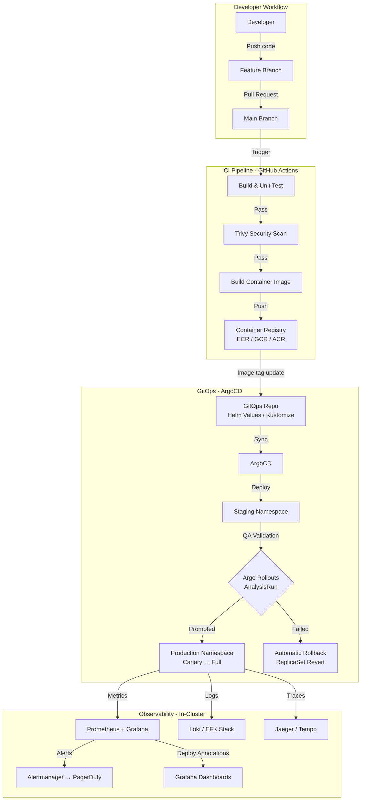
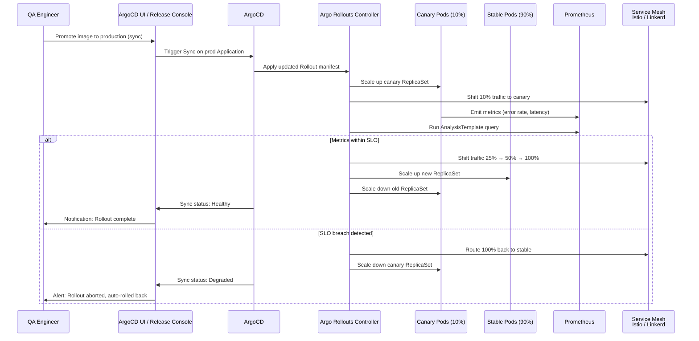
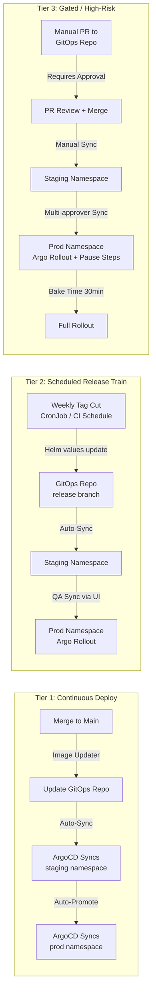
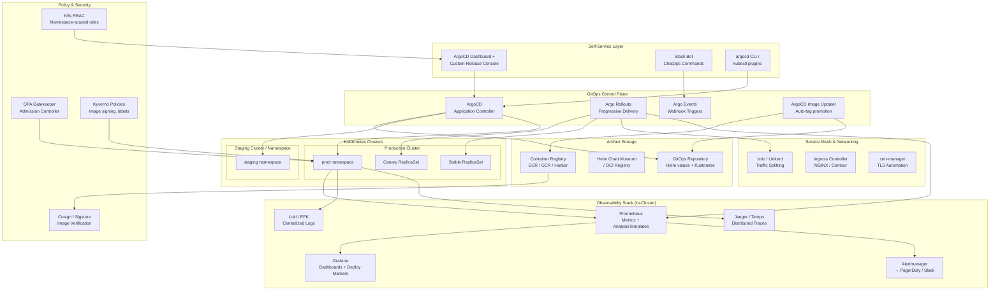
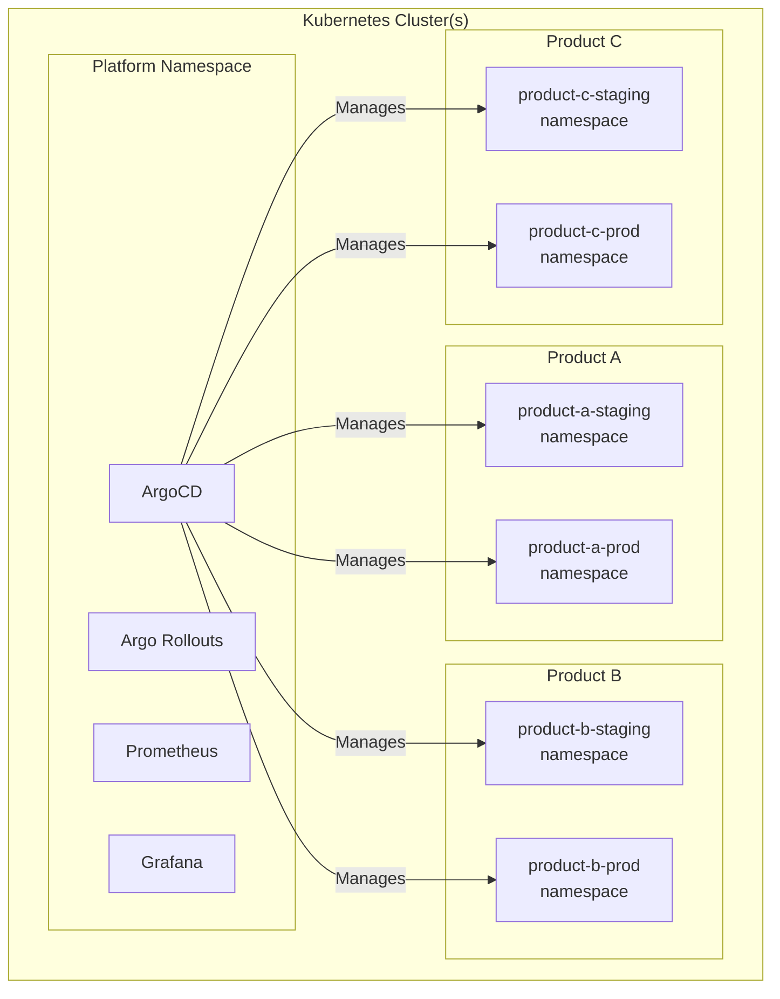

# Release Engineering Initiative: Proposal (Kubernetes-Native)

## Executive Summary

This proposal outlines an approach to mature release engineering across a multi-product organization running on Kubernetes. The core strategy is to leverage the Kubernetes ecosystem — GitOps with ArgoCD, progressive delivery with Argo Rollouts, Helm for packaging, and a service mesh for traffic management — to introduce structure incrementally while balancing standardization with team autonomy.

The guiding principle: **make the safe path the easy path.** Rather than enforcing rigid processes, we build platform tooling on top of Kubernetes primitives that make consistent, observable releases the default behavior.

---

## High-Level Architecture



## Deployment Flow: Argo Rollouts Progressive Delivery



## Cadence Tiers & GitOps Topology



## Platform Architecture (Kubernetes-Native)



## Namespace & Cluster Topology



---

## Context & Assumptions

- Multiple products deployed as containerized microservices on Kubernetes
- Kubernetes cluster(s) already provisioned (EKS, GKE, AKS, or self-managed)
- QA engineers who are capable but lack safe, repeatable mechanisms to trigger K8s deployments
- Limited visibility into what's running in which namespace, and limited rollback confidence
- Growth trajectory that will strain ad-hoc `kubectl apply` workflows

---

## 1. Establishing a Predictable Release Cadence

### Approach

Establish **cadence tiers** based on product risk profile, implemented via ArgoCD sync policies:

| Tier | Cadence | ArgoCD Config | Example |
|------|---------|---------------|---------|
| **Continuous** | On image push | Auto-sync enabled + ArgoCD Image Updater | Low-risk internal tools, feature-flagged services |
| **Scheduled** | Weekly or biweekly | Auto-sync disabled, scheduled PR via CI CronJob | Core product services |
| **Gated** | On-demand with approval | Manual sync + Argo Rollouts pause steps | Payment systems, auth, data-sensitive services |

### Implementation

1. **ArgoCD Applications per environment** — each service has separate ArgoCD `Application` resources for staging and production, with sync policies matching their tier.
2. **ArgoCD Image Updater** — for Tier 1 services, automatically detects new images in the registry and updates the GitOps repo, triggering a sync.
3. **Release train via CI schedule** — for Tier 2, a weekly CI job creates a PR to the GitOps repo bumping image tags for all services in the train.
4. **Feature flags (Flagsmith/LaunchDarkly)** — decouple deploy from release. Code ships to pods continuously; features activate on schedule via flag changes.

### Why This Works

GitOps makes cadence explicit and auditable. The GitOps repo is the single source of truth — you can see exactly what's deployed by reading the repo state, and the commit history shows when each change was promoted.

---

## 2. Standardizing Deployment Practices

### Approach

Standardize on **GitOps + Helm + Argo Rollouts** as the universal deployment mechanism. Every service, regardless of cadence, deploys the same way through Kubernetes primitives.

### Key Standards

- **Immutable container images** — build once, push to registry, promote the same image SHA through environments. Never rebuild.
- **Helm charts with shared library chart** — a base Helm library chart provides standard Deployment/Rollout, Service, HPA, PDB, and NetworkPolicy templates. Teams extend it with values files.
- **Argo Rollouts for progressive delivery** — canary deployments with automated analysis as the default strategy. Traffic splitting via Istio/Linkerd VirtualService.
- **Namespace-per-environment** — `product-a-staging`, `product-a-prod`. Environment parity enforced by using the same Helm chart with different values.

### Implementation

1. **Shared Helm library chart** — provides:
   ```yaml
   # Example: teams only write a values.yaml
   replicaCount: 3
   image:
     repository: ecr.aws/myorg/product-a
     tag: "sha-abc123"  # immutable SHA
   rollout:
     strategy: canary
     steps:
       - setWeight: 10
       - pause: { duration: 5m }
       - setWeight: 50
       - pause: { duration: 5m }
       - setWeight: 100
     analysis:
       successCondition: "result[0] < 0.05"  # error rate < 5%
       metricName: http_request_errors_rate
   healthCheck:
     path: /healthz
     port: 8080
   resources:
     requests: { cpu: 100m, memory: 128Mi }
     limits: { cpu: 500m, memory: 512Mi }
   ```

2. **Argo Rollouts AnalysisTemplates** — shared templates for common health checks:
   - HTTP error rate (Prometheus query)
   - P99 latency threshold
   - Pod restart count
   - Custom business metrics

3. **OPA Gatekeeper / Kyverno policies** — enforce standards at admission time:
   - All images must be signed (Cosign)
   - All pods must have resource limits
   - All Rollouts must include an AnalysisTemplate
   - No `latest` tags allowed in production namespaces

4. **GitOps repo structure:**
   ```
   gitops-repo/
   ├── apps/
   │   ├── product-a/
   │   │   ├── base/              # Kustomize base or Helm chart reference
   │   │   ├── staging/
   │   │   │   └── values.yaml   # Staging overrides
   │   │   └── production/
   │   │       └── values.yaml   # Production overrides (rollout steps, replicas)
   │   ├── product-b/
   │   └── product-c/
   ├── platform/
   │   ├── argocd/
   │   ├── argo-rollouts/
   │   ├── prometheus/
   │   └── istio/
   └── policies/
       ├── gatekeeper-constraints/
       └── kyverno-policies/
   ```

### Risk Reduction

GitOps provides automatic drift detection — ArgoCD alerts when cluster state diverges from the desired state in Git. Combined with admission policies, it becomes impossible to deploy non-compliant workloads.

---

## 3. Enabling QA Engineers to Manage Routine Releases

### Approach

Expose ArgoCD and Argo Rollouts through **scoped RBAC and a simplified UI** so QA engineers can manage releases without needing `kubectl` access.

### Capabilities

- **ArgoCD UI for sync operations** — QA clicks "Sync" on the production Application to promote a validated staging image
- **Argo Rollouts dashboard** — real-time view of canary progress, ability to promote or abort
- **Namespace-scoped RBAC** — QA gets ArgoCD `Application` sync permissions only for their product's namespaces
- **Pre-sync hooks** — automated pre-checks (image scan results, test status) that block sync if not passing

### Implementation

1. **ArgoCD RBAC with SSO:**
   ```csv
   # ArgoCD RBAC policy
   p, role:qa-product-a, applications, sync, product-a/*, allow
   p, role:qa-product-a, applications, get, product-a/*, allow
   p, role:qa-product-a, applications, action/rollback, product-a/*, allow
   g, qa-team-a, role:qa-product-a
   ```

2. **Argo Rollouts `kubectl` plugin or Dashboard:**
   - QA can run `kubectl argo rollouts promote product-a` or use the Argo Rollouts Dashboard UI
   - Abort with `kubectl argo rollouts abort product-a`

3. **Slack-integrated notifications (Argo Notifications):**
   ```yaml
   apiVersion: argoproj.io/v1alpha1
   kind: Application
   metadata:
     annotations:
       notifications.argoproj.io/subscribe.on-sync-succeeded.slack: release-channel
       notifications.argoproj.io/subscribe.on-health-degraded.slack: release-channel
   ```

4. **Graduated trust model:**
   - Week 1-4: QA syncs staging Applications only
   - Week 5-8: QA syncs production for Tier 1 (continuous) services
   - Week 9+: QA manages production Rollouts for Tier 2 services with canary analysis protecting them

### Why This Matters

ArgoCD's UI abstracts Kubernetes complexity. QA doesn't need to understand ReplicaSets or Pod specs — they see Applications, sync status, and health. The platform's safety nets (Rollouts analysis, admission policies) protect against mistakes.

---

## 4. Improving Visibility, Rollback, and Observability

### Release Visibility

- **ArgoCD Application dashboard** — shows sync status, health, and deployed image tags for every service across all namespaces
- **GitOps commit history** — the GitOps repo provides a complete audit trail. Every deployment is a Git commit with author, timestamp, and diff.
- **Grafana deploy annotations** — ArgoCD Notifications triggers Grafana annotations on sync events, marking exactly when each deployment happened on metric dashboards
- **Argo Notifications → Slack** — real-time deployment feed in a `#releases` channel

### Rollback Capabilities

- **Instant rollback via ArgoCD** — "Rollback" button in ArgoCD UI reverts to any previous sync revision (Git commit). QA can trigger this.
- **Argo Rollouts abort** — during a canary, abort immediately routes 100% traffic back to the stable ReplicaSet. Zero downtime.
- **GitOps revert** — `git revert` on the GitOps repo commit, ArgoCD auto-syncs the previous state. Fully auditable.
- **Kubernetes-native:** previous ReplicaSets are retained (configurable via `revisionHistoryLimit`), so rollback is just pointing the Rollout back to the old RS.
- **Database-aware rollbacks** — enforce expand-and-contract migrations. Schema changes are always forward-compatible. Use Kubernetes Jobs as ArgoCD PreSync hooks for migrations.
- **Rollback drills** — quarterly game days where QA practices aborting a canary rollout and reverting a GitOps commit.

### Observability

- **Prometheus + Grafana** — metrics from all pods with service mesh sidecar providing RED metrics (Rate, Errors, Duration) automatically
- **Argo Rollouts AnalysisRun results** — stored as K8s resources, queryable and visible in the Rollouts dashboard
- **SLO-based deployment gates:**
  ```yaml
  # AnalysisTemplate: block promotion if error budget exhausted
  metrics:
    - name: error-budget-remaining
      provider:
        prometheus:
          address: http://prometheus.monitoring:9090
          query: |
            1 - (sum(rate(http_requests_total{status=~"5.*",service="{{args.service}}"}[1h]))
            / sum(rate(http_requests_total{service="{{args.service}}"}[1h])))
      successCondition: result[0] > 0.001  # must have error budget remaining
  ```
- **Distributed tracing** — Jaeger/Tempo integrated with service mesh for request-level visibility during canary analysis
- **Pod-level audit** — Kubernetes audit logs + Falco for runtime security events

---

## 5. Maintainability at Scale

### Principles

- **Platform team owns the platform namespace** — ArgoCD, Argo Rollouts, Prometheus, Istio. Product teams own their application namespaces.
- **App-of-apps pattern** — ArgoCD manages itself and all Application definitions from a single root Application. Adding a new service = one PR to the GitOps repo.
- **ApplicationSets for scaling** — use ArgoCD ApplicationSets to template Applications for new services/teams automatically:
  ```yaml
  apiVersion: argoproj.io/v1alpha1
  kind: ApplicationSet
  metadata:
    name: product-services
  spec:
    generators:
      - git:
          repoURL: https://github.com/org/gitops-repo
          directories:
            - path: apps/*
    template:
      metadata:
        name: '{{path.basename}}'
      spec:
        destination:
          namespace: '{{path.basename}}-prod'
          server: https://kubernetes.default.svc
        source:
          repoURL: https://github.com/org/gitops-repo
          path: '{{path}}/production'
  ```

- **Golden path:** new services get a working deployment on day one by:
  1. Adding a directory to the GitOps repo
  2. Referencing the shared Helm library chart
  3. ApplicationSet auto-discovers and creates the ArgoCD Application

### Scaling Mechanisms

1. **Multi-cluster management** — as the org grows, ArgoCD manages multiple clusters from a single control plane. Services promote across clusters (dev cluster → staging cluster → prod cluster).
2. **Backstage service catalog** — integrates with ArgoCD API to show deployment status, health, and ownership per service.
3. **Policy as code with Kyverno/OPA** — organizational policies are Kubernetes resources, version-controlled and applied uniformly.
4. **DORA metrics from GitOps data:**
   - **Deployment frequency** = commits to GitOps repo per service per week
   - **Lead time** = time from app repo merge to GitOps repo sync
   - **Change failure rate** = Argo Rollouts aborts / total rollouts
   - **MTTR** = time from abort to successful re-deploy

---

## Prioritization & Trade-offs

| Tension | Resolution |
|---------|------------|
| Standardization vs. team autonomy | Shared Helm library chart with sensible defaults. Teams override via values files. Admission policies enforce only safety-critical standards. |
| Speed vs. safety | Argo Rollouts gives both — deploy immediately with canary, promote only when metrics are healthy. Fast and safe. |
| QA empowerment vs. risk | Namespace-scoped RBAC limits blast radius. Argo Rollouts analysis provides an automated safety net that catches issues even if QA misses them. |
| Predictability vs. flexibility | ArgoCD sync policies per Application. Continuous services auto-sync; gated services require manual sync. Same tooling, different config. |
| GitOps purity vs. pragmatism | Use GitOps as the primary path, but allow emergency `kubectl` access with audit logging for break-glass scenarios. |

### Phased Rollout

| Phase | Timeline | Focus | Key Deliverables |
|-------|----------|-------|------------------|
| **Phase 1** | Weeks 1–4 | Foundation | ArgoCD + GitOps repo setup, shared Helm library chart, container image signing, namespace structure |
| **Phase 2** | Weeks 5–8 | Progressive delivery | Argo Rollouts for production, AnalysisTemplates with Prometheus, Grafana deploy annotations |
| **Phase 3** | Weeks 9–12 | QA enablement | ArgoCD RBAC for QA, Argo Notifications to Slack, release console UI, graduated trust rollout |
| **Phase 4** | Ongoing | Scale & mature | ApplicationSets, multi-cluster, Backstage catalog, DORA metrics dashboard, policy expansion, rollback drills |

Phase 1 delivers the most risk reduction — GitOps alone eliminates configuration drift, provides audit trails, and enables instant rollback via `git revert`.

---

## Summary

The proposal builds on Kubernetes-native tooling:

| Concern | Solution |
|---------|----------|
| Deployment mechanism | ArgoCD GitOps + Helm |
| Progressive delivery | Argo Rollouts (canary + analysis) |
| Traffic management | Istio / Linkerd service mesh |
| Rollback | Git revert → ArgoCD auto-sync, or Rollout abort |
| QA access | ArgoCD UI + scoped RBAC |
| Policy enforcement | OPA Gatekeeper / Kyverno admission controllers |
| Observability | Prometheus + Grafana + Loki + Jaeger (in-cluster) |
| Scaling | ApplicationSets + multi-cluster ArgoCD |

The approach optimizes for:

1. **Safety** — canary analysis catches bad deploys before they hit 100% of traffic
2. **Clarity** — Git history is the deployment ledger; ArgoCD UI shows live state
3. **Autonomy** — teams own their values files and cadence; the platform provides guardrails
4. **Sustainability** — adding a new service is one PR; the platform scales without proportional DevOps headcount
